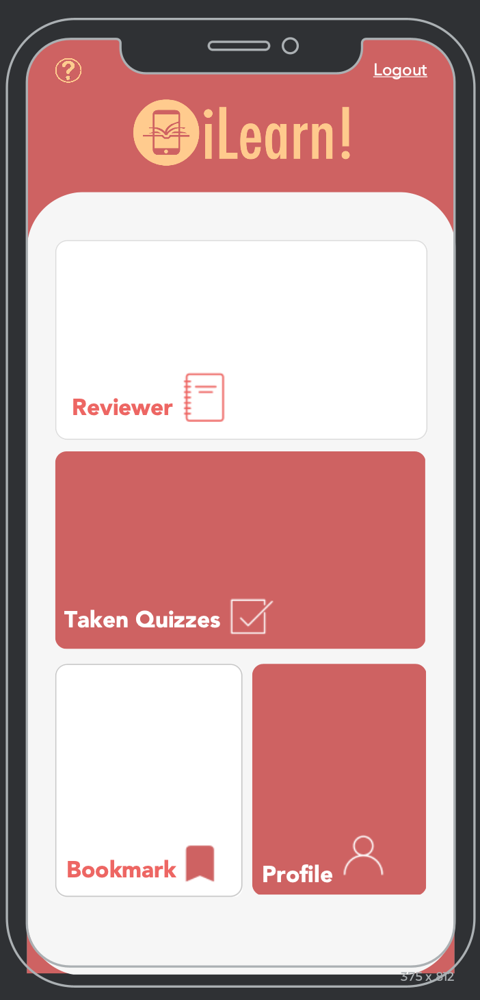
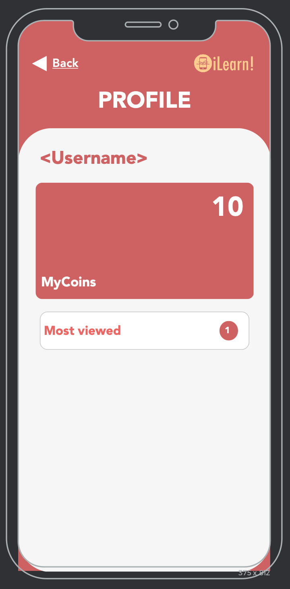
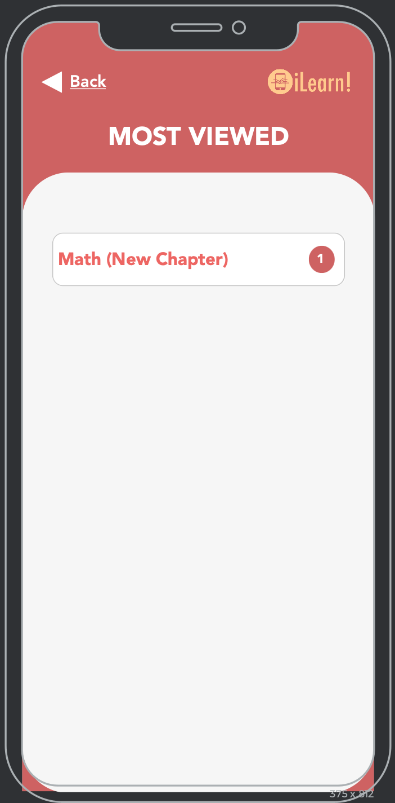
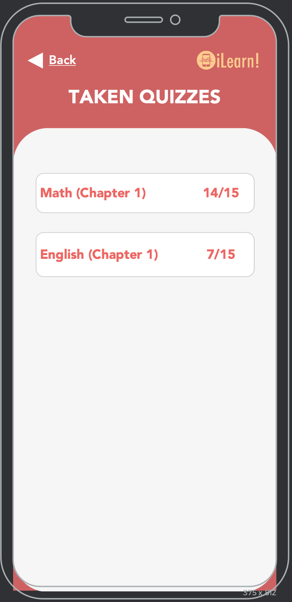
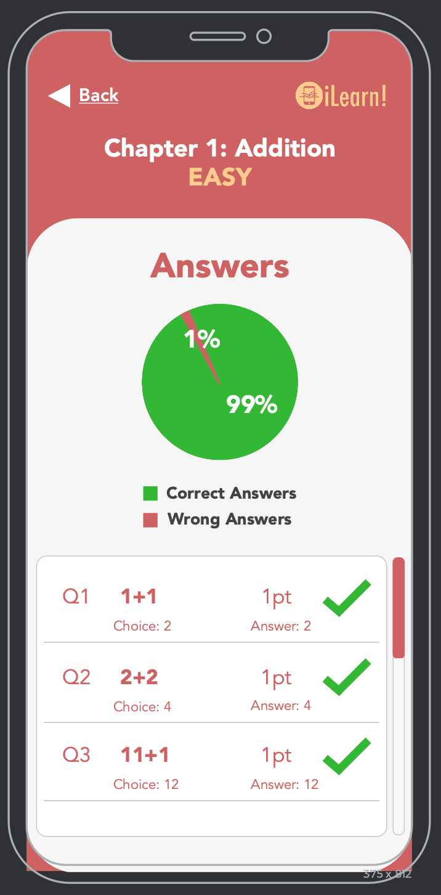

The user can use the one tap login once he/she already has logged in on that app.

The user can login and signup for the app.

The user can see the reviewer, taken quizzes, etc. in the home page.

This is the information of the app.

The user can view his/her bookmarked topics.

The user can view his/her profile.

The user will be notified if there is a new update on the topic that he/she always view.

This is where the taken quizzes of the user.

This is where the user can check the answers of his/her taken quizzes.

List of all subjects the user can learn.

List of all topics of a certain subject the user can learn.

The user can choose what type of reviewer he/she wants.

The user can use the dictionary if ever he/she doesn't know a certain word.

The user can use the calculator on the math reviewer.

The user can choose what level of quiz he/she wants to take.

The user answers the 10 given questions and can use hint by spending coins.

The user can view his/her total score.

The user can view the answers of the quiz.

The leaderboard will display the ranking of the quiz.

The user can buy coins using real money.
