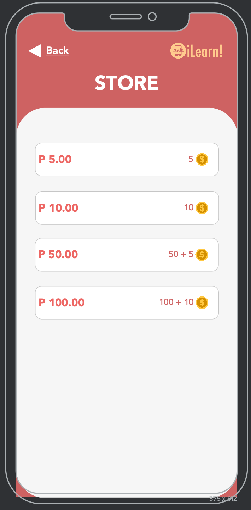

# Positive and Negative Reinforcement (Lalis)

## Positive Reinforcement

In our app, we applied the feature of a leaderboard and giving them reward such as coins that will give the user the eagerness to use our app.

## Negative Reinforcement

In our app, we applied the feature of a store that can buy coins by using real money of the user.
